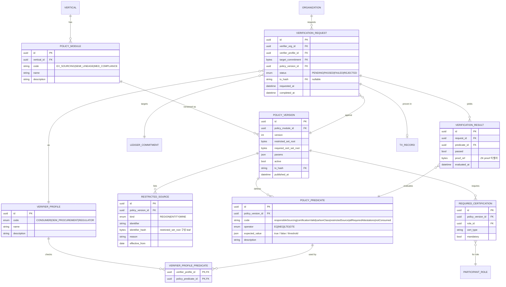

# Veilance ERD

> landing.md 기준 데이터 모델. MVP(Mine → Refiner → Battery Manufacturer)를 1차 범위로 하되,
> Semiconductor / Medical Device 확장 시 **Provenance Core는 그대로 두고 Policy Module만 교체**할 수 있도록 설계한다.

---

## 1. 데이터 레이어

Veilance의 데이터는 "누가 볼 수 있는가"에 따라 세 레이어로 나뉜다. ERD의 모든 엔티티는 이 중 하나에 속한다.

| 레이어 | 저장 위치 | 가시성 | 포함 데이터 |
|---|---|---|---|
| **L1. Ledger (Midnight public state)** | Midnight 온체인 | 모든 참여자에게 공개 | commitment set, nullifier set, policy version, revocation |
| **L2. Private State** | 각 participant의 로컬 (witness 소스) | **해당 기업만** | supplierSecret, origin, quantity, price, upstream 링크 등 commercial data |
| **L3. Off-chain App DB** | dApp 백엔드 / indexer | 참여자 공통 메타데이터 | organization, certification 메타, policy 정의, tx 인덱스, verification 이력 |

핵심 원칙:

- L2 데이터는 **절대 L1/L3로 올라가지 않는다.** L1에는 해시(commitment/nullifier)만 올라간다.
- L1의 commitment와 nullifier 사이의 연결(어떤 commitment가 소비되어 어떤 commitment가 되었는가)은 L2에만 존재한다. → supplier graph 비공개.
- L3는 편의용 인덱스이며, 진실의 원천(source of truth)은 L1이다.

---

## 2. 전체 ERD

### 2.1 Provenance Core (Ledger + Private State + Tx)

```mermaid
erDiagram
    ORGANIZATION ||--o{ PRIVATE_CREDENTIAL : "holds"
    ORGANIZATION ||--o{ CERTIFICATION : "has"
    ORGANIZATION ||--o{ TRANSITION : "performs"
    ORGANIZATION ||--o{ TX_RECORD : "submits"
    ORGANIZATION }o--|| PARTICIPANT_ROLE : "acts as"
    PARTICIPANT_ROLE }o--|| VERTICAL : "belongs to"

    PRIVATE_CREDENTIAL o|--o| PRIVATE_CREDENTIAL : "upstream (parent)"
    PRIVATE_CREDENTIAL }o--|| MATERIAL_TYPE : "of"
    PRIVATE_CREDENTIAL }o--o| CERTIFICATION : "backed by"
    PRIVATE_CREDENTIAL ||--|| LEDGER_COMMITMENT : "commits to"
    PRIVATE_CREDENTIAL ||--o| LEDGER_NULLIFIER : "consumed as"

    TRANSITION }o--|| PRIVATE_CREDENTIAL : "consumes (upstream)"
    TRANSITION ||--|| PRIVATE_CREDENTIAL : "produces (new)"
    TRANSITION ||--|| TX_RECORD : "recorded in"
    TRANSITION }o--|| POLICY_VERSION : "checked against"

    LEDGER_COMMITMENT }o--|| POLICY_VERSION : "issued under"
    LEDGER_COMMITMENT ||--|| TX_RECORD : "created by"
    LEDGER_NULLIFIER ||--|| TX_RECORD : "created by"
    LEDGER_REVOCATION ||--|| TX_RECORD : "created by"
    LEDGER_REVOCATION }o--o| CERTIFICATION : "revokes"
    LEDGER_REVOCATION }o--o| LEDGER_COMMITMENT : "revokes"

    QUANTITY_ALLOCATION }o--|| TRANSITION : "splits (future)"
    QUANTITY_ALLOCATION }o--|| PRIVATE_CREDENTIAL : "output (future)"

    ORGANIZATION {
        uuid id PK
        string name
        string midnight_address
        bytes public_key
        uuid role_id FK
        enum status "ACTIVE|SUSPENDED|SANCTIONED"
        datetime created_at
    }

    VERTICAL {
        uuid id PK
        enum code "EV_BATTERY|SEMICONDUCTOR|MEDICAL_DEVICE"
        string name
        bool active
    }

    PARTICIPANT_ROLE {
        uuid id PK
        uuid vertical_id FK
        string code "MINE|REFINER|MATERIAL_PRODUCER|CELL_MANUFACTURER|BATTERY_OEM|AUDITOR"
        int stage_order
        bool can_issue_root
        bool can_verify
    }

    MATERIAL_TYPE {
        uuid id PK
        uuid vertical_id FK
        string code "COBALT|LITHIUM|NICKEL|..."
        string unit "kg"
    }

    CERTIFICATION {
        uuid id PK
        uuid org_id FK
        string cert_type "RESPONSIBLE_SOURCING|ISO|CARBON_CLASS|..."
        string issuer
        bytes cert_hash "witness에 들어가는 해시"
        date valid_from
        date valid_to
        enum status "VALID|EXPIRED|REVOKED"
    }

    PRIVATE_CREDENTIAL {
        uuid id PK
        uuid holder_org_id FK
        uuid upstream_credential_id FK "nullable, Mine이면 null"
        uuid material_type_id FK
        uuid certification_id FK
        bytes supplier_secret "PRIVATE"
        bytes batch_secret "PRIVATE"
        string origin "PRIVATE (mineLocation)"
        int carbon_class "PRIVATE, commitment 포함, 하류에서 감소 불가"
        decimal quantity "PRIVATE (future)"
        decimal purchase_price "PRIVATE"
        json commercial_terms "PRIVATE"
        bytes commitment "= LEDGER_COMMITMENT.commitment"
        bytes nullifier "consume 시 유도, PRIVATE until spent"
        enum status "ACTIVE|CONSUMED|REVOKED"
        datetime issued_at
    }

    LEDGER_COMMITMENT {
        bytes commitment PK "provenanceCommitment"
        uuid policy_version_id FK
        enum circuit "ISSUE|TRANSFER"
        string tx_hash FK
        bigint block_height
        datetime created_at
    }

    LEDGER_NULLIFIER {
        bytes nullifier PK "upstreamNullifier"
        string tx_hash FK
        bigint block_height
        datetime consumed_at
    }

    LEDGER_REVOCATION {
        uuid id PK
        enum target_type "CERTIFICATION|COMMITMENT"
        bytes target_hash
        uuid certification_id FK "nullable"
        bytes commitment FK "nullable"
        string reason
        string tx_hash FK
        datetime revoked_at
    }

    POLICY_VERSION {
        uuid id PK
        uuid policy_module_id FK
        int version
        bytes restricted_set_root "온체인 게시"
        bytes required_cert_set_root "온체인 게시"
        json params "carbon threshold 등"
        bool active
        string tx_hash FK
        datetime published_at
    }

    TRANSITION {
        uuid id PK
        uuid actor_org_id FK
        uuid upstream_credential_id FK "PRIVATE 링크"
        uuid new_credential_id FK "PRIVATE 링크"
        uuid policy_version_id FK
        bytes upstream_nullifier "public"
        bytes new_commitment "public"
        json predicate_results "supplierCertified 등 4개"
        string tx_hash FK
        datetime created_at
    }

    QUANTITY_ALLOCATION {
        uuid id PK
        uuid transition_id FK
        uuid output_credential_id FK
        decimal output_quantity "PRIVATE"
        bytes conservation_proof_ref "sum(out) <= in"
    }

    TX_RECORD {
        string tx_hash PK
        uuid submitter_org_id FK
        enum circuit "ISSUE_PROVENANCE|TRANSFER_PROVENANCE|VERIFY_POLICY|PUBLISH_POLICY|REVOKE"
        enum status "PENDING|SUCCESS|REJECTED"
        string rejection_reason "e.g. PROVENANCE_ALREADY_CONSUMED"
        bigint block_height
        datetime submitted_at
        datetime finalized_at
    }
```

### 2.2 Policy Module & Verification



---

## 3. 엔티티 상세

### 3.1 L1 — Ledger (Midnight public state)

landing §6에서 정의한 shared state 5종을 그대로 엔티티로 매핑한다.

| landing §6 shared state | 엔티티 | 비고 |
|---|---|---|
| provenance commitment | `LEDGER_COMMITMENT` | Circuit 1/2의 public output |
| nullifier / consumption state | `LEDGER_NULLIFIER` | Circuit 2의 public output. 중복 시 tx REJECTED |
| credential validity | `LEDGER_COMMITMENT` + `LEDGER_REVOCATION` 조합 | commitment 존재 ∧ revocation 없음 = valid |
| revocation state | `LEDGER_REVOCATION` | certification 또는 commitment 단위 |
| policy version | `POLICY_VERSION` (root 해시만 온체인) | restricted set / required cert set은 Merkle root로 게시 |
| (v3 추가) 수신 키 | `ORGANIZATION.enc_public_key` ↔ 온체인 `partyEncKeys` | X25519 공개키, partyId 로 키잉 |
| (v3 추가) 봉인된 pre-image | `CREDENTIAL_INBOX` (순번, Bytes<192>) | 컨트랙트 설계 §4.2 참조. 수신자는 시도 복호화로 자기 항목을 찾음 |

**`LEDGER_COMMITMENT`**

| 컬럼 | 타입 | 설명 |
|---|---|---|
| commitment | bytes PK | `provenanceCommitment`. private witness 전체의 commitment |
| policy_version_id | FK | 어떤 정책 버전 하에서 발행되었는지 |
| circuit | enum | `ISSUE`(Mine 루트) / `TRANSFER`(하위 단계) |
| tx_hash | FK | 생성 tx |
| block_height | bigint | |

온체인에는 **parent commitment를 저장하지 않는다.** 저장하면 batch linkage가 노출된다(landing §8). lineage는 L2의 `PRIVATE_CREDENTIAL.upstream_credential_id`에만 존재한다.

**`LEDGER_NULLIFIER`**

| 컬럼 | 타입 | 설명 |
|---|---|---|
| nullifier | bytes PK | `upstreamNullifier`. upstream credential의 secret에서 결정적으로 유도 |
| tx_hash | FK | 소비 tx |
| consumed_at | datetime | |

nullifier는 commitment와 공개적으로 연결되지 않는다. 따라서 "어떤 commitment가 소비되었는지"는 외부에서 알 수 없고, "이 nullifier가 이미 존재하는가"만 검사한다.

**`LEDGER_REVOCATION`**

| 컬럼 | 타입 | 설명 |
|---|---|---|
| target_type | enum | `CERTIFICATION` / `COMMITMENT` |
| target_hash | bytes | 취소 대상 해시 |
| reason | string | |
| tx_hash | FK | |

MVP에서는 선택 사항. Circuit 2의 `upstreamCredentialValid` 조건이 revocation set 부재 확인까지 포함하도록 확장할 때 필요.

### 3.2 L2 — Private State (participant local)

**`PRIVATE_CREDENTIAL`** — landing §4의 Refiner private 데이터 + §9 Circuit 1 witness를 한 레코드로 표현.

| 컬럼 | 가시성 | landing 대응 |
|---|---|---|
| holder_org_id | private | 보유 기업 |
| upstream_credential_id | **private** | `upstreamSupplier` / parent → child lineage |
| material_type_id | private | cobalt 등 |
| certification_id | private | `certification` |
| supplier_secret | **private** | `supplierSecret` |
| batch_secret | **private** | `batchSecret` / `batchId` |
| origin | **private** | `origin` / `mineLocation` |
| carbon_class | **private** | `carbonClass <= threshold` predicate 용. commitment 에 포함 |
| quantity | **private** | `materialAmount` (MVP 컨트랙트 미포함) |
| purchase_price | **private** | `purchasePrice` |
| commercial_terms | **private** | `commercialTerms` |
| commitment | public 미러 | `LEDGER_COMMITMENT.commitment` |
| nullifier | private → 소비 시 public | consume 전까지는 로컬에만 존재 |
| status | private | `ACTIVE` / `CONSUMED` / `REVOKED` |

자기참조 `upstream_credential_id`가 곧 supplier graph다. 이 컬럼이 L2에만 있다는 것이 Veilance의 privacy 보장의 핵심이다.

**`TRANSITION`** — Circuit 2 실행 1회 = 1 레코드. actor의 로컬에 저장.

| 컬럼 | 가시성 | 설명 |
|---|---|---|
| upstream_credential_id | private | 소비한 credential |
| new_credential_id | private | 생성한 credential |
| upstream_nullifier | public | 온체인 게시값 |
| new_commitment | public | 온체인 게시값 |
| predicate_results | private | `upstreamCredentialValid`, `supplierCertified`, `originNotRestricted`, `credentialNotConsumed` 각 결과 |
| policy_version_id | public | 검증에 사용한 정책 |
| tx_hash | public | |

MVP에서 1 upstream → 1 new (1:1). `QUANTITY_ALLOCATION`은 향후 1 → N split(conservation) 확장용이며, MVP에서는 테이블만 예약한다.

**`QUANTITY_ALLOCATION`** (future, landing §7)

| 컬럼 | 설명 |
|---|---|
| transition_id | 어떤 transition에서 split 되었는가 |
| output_credential_id | 산출 credential |
| output_quantity | private |
| conservation_proof_ref | `Σ output ≤ input` 증명 참조 |

### 3.3 L3 — Off-chain App DB

**`ORGANIZATION`** — landing §6의 participant (Mine, Refiner, Material Producer, Cell Manufacturer, OEM, Auditor).

| 컬럼 | 설명 |
|---|---|
| midnight_address | 온체인 식별자 |
| public_key | 서명/암호화용 |
| role_id | `PARTICIPANT_ROLE` |
| status | `SANCTIONED`면 `RESTRICTED_SOURCE`(kind=ENTITY)와 동기화 |

**`VERTICAL` / `PARTICIPANT_ROLE`** — landing §13 roadmap의 산업별 공급망 단계.

| vertical | roles (stage_order 순) |
|---|---|
| EV_BATTERY | MINE → REFINER → MATERIAL_PRODUCER → CELL_MANUFACTURER → BATTERY_OEM |
| SEMICONDUCTOR | FAB → OSAT → DISTRIBUTOR → OEM |
| MEDICAL_DEVICE | COMPONENT_SUPPLIER → DEVICE_MANUFACTURER → STERILIZATION_PROVIDER → DISTRIBUTOR → HOSPITAL |

`can_issue_root=true`인 role(MINE, FAB, COMPONENT_SUPPLIER)만 Circuit 1을 실행할 수 있다.

**`CERTIFICATION`** — 기업이 보유한 인증. 원본은 L3, `cert_hash`만 witness로 들어간다. 만료/취소는 `status`와 `LEDGER_REVOCATION`으로 이중 관리.

**`TX_RECORD`** — 온체인 tx 인덱스. Demo Step 4(공격 시나리오)에서 `status=REJECTED, rejection_reason=PROVENANCE_ALREADY_CONSUMED`로 기록된다.

### 3.4 Policy Module

landing §14의 Policy Modules 계층. **산업별로 바뀌는 것은 이 그룹뿐**이다.

**`POLICY_MODULE`**

| code | vertical | 초점 (landing §13) |
|---|---|---|
| EV_SOURCING | EV_BATTERY | sourcing + material conservation |
| SEMI_LINEAGE | SEMICONDUCTOR | authenticated lineage |
| MED_COMPLIANCE | MEDICAL_DEVICE | component / process compliance |

**`POLICY_VERSION`** — 온체인 `policy version`의 off-chain 원본. `restricted_set_root`, `required_cert_set_root`는 온체인 게시값이고, 실제 리스트는 `RESTRICTED_SOURCE`, `REQUIRED_CERTIFICATION`에 있다. commitment는 발행 당시의 policy version에 고정된다.

**`POLICY_PREDICATE`** — landing §5.2의 predicate를 데이터로 표현.

| code | operator | expected | 사용 profile |
|---|---|---|---|
| responsibleSourcing | EQ | true | CONSUMER, OEM_PROCUREMENT |
| certificationValid | EQ | true | OEM_PROCUREMENT |
| carbonClass | LTE | threshold(params) | OEM_PROCUREMENT |
| allRequiredAttestations | EQ | true | REGULATOR |
| restrictedSource | EQ | false | REGULATOR |
| notConsumed | EQ | true | 전체 (duplicate claim ✗) |

**`VERIFIER_PROFILE` ↔ `POLICY_PREDICATE`** (M:N via `VERIFIER_PROFILE_PREDICATE`) — 같은 commitment에 대해 verifier마다 다른 predicate 집합을 검증한다는 §5.2의 Selective Policy Disclosure를 그대로 모델링.

### 3.5 Verification

**`VERIFICATION_REQUEST`** — Circuit 3 실행 단위. verifier org가 특정 commitment에 대해 특정 profile의 predicate 집합을 요청.

**`VERIFICATION_RESULT`** — predicate 하나당 1행. Demo Step 3의 OEM 화면(Responsible sourcing ✓ / Valid chain of custody ✓ / Restricted source ✗ / Duplicate claim ✗)이 곧 이 테이블의 4행이다.

---

## 4. Circuit ↔ 엔티티 매핑 (landing §9)

| Circuit | Private witness (읽기, L2) | 검증 참조 (읽기, L1/L3) | Public output (쓰기, L1) | App 기록 (쓰기, L2/L3) |
|---|---|---|---|---|
| **1. Issue Provenance** | `PRIVATE_CREDENTIAL` 신규 (supplier_secret, origin, certification, batch_secret) | `POLICY_VERSION`(active), `CERTIFICATION.cert_hash` | `LEDGER_COMMITMENT` | `PRIVATE_CREDENTIAL.status=ACTIVE`, `TX_RECORD` |
| **2. Transfer / Transform** | upstream `PRIVATE_CREDENTIAL` 전체 + 신규 credential 데이터 | `LEDGER_COMMITMENT`(upstream 존재), `LEDGER_NULLIFIER`(부재), `LEDGER_REVOCATION`(부재), `POLICY_VERSION.restricted_set_root`, `required_cert_set_root` | `LEDGER_COMMITMENT`(new), `LEDGER_NULLIFIER`(upstream) | `TRANSITION`, upstream `status=CONSUMED`, new `PRIVATE_CREDENTIAL`, `TX_RECORD` |
| **3. Verify Policy** | holder의 `PRIVATE_CREDENTIAL` (holder가 증명자) | `LEDGER_COMMITMENT`, `LEDGER_NULLIFIER`, `POLICY_PREDICATE` (profile별) | (선택) 검증 tx | `VERIFICATION_REQUEST`, `VERIFICATION_RESULT` |

Circuit 2의 4개 조건 → 데이터 소스:

| 조건 | 확인 대상 |
|---|---|
| upstreamCredentialValid | `LEDGER_COMMITMENT`에 존재 ∧ `LEDGER_REVOCATION`에 없음 |
| supplierCertified | `CERTIFICATION.cert_hash` ∈ `required_cert_set_root` |
| originNotRestricted | `origin` 해시 ∉ `restricted_set_root` |
| credentialNotConsumed | 유도한 nullifier ∉ `LEDGER_NULLIFIER` |

---

## 5. Demo 데이터 흐름 (landing §10)

| Step | 행위자 | 생성/변경되는 레코드 |
|---|---|---|
| 1. 공급망 등록 | Mine | `PRIVATE_CREDENTIAL(A)` [Mine 로컬], `LEDGER_COMMITMENT(cA)`, `TX_RECORD(ISSUE, SUCCESS)` |
| 2. Refiner | Refiner | `PRIVATE_CREDENTIAL(B)` [Refiner 로컬, upstream=A], `TRANSITION(A→B)`, `LEDGER_NULLIFIER(nA)`, `LEDGER_COMMITMENT(cB)`, A.status=CONSUMED, `TX_RECORD(TRANSFER, SUCCESS)` |
| 3. Battery OEM | OEM (verifier) | `VERIFICATION_REQUEST(cB, profile=OEM_PROCUREMENT)`, `VERIFICATION_RESULT` × 4 |
| 4. 공격 | Refiner | `TRANSITION` 시도 → nullifier nA 이미 존재 → `TX_RECORD(TRANSFER, REJECTED, PROVENANCE_ALREADY_CONSUMED)`. L1 변경 없음 |

Step 2에서 OEM은 `cB`, `nA`만 볼 수 있고 `cA ↔ nA`, `A ↔ B` 연결은 Refiner 로컬(`TRANSITION`, `PRIVATE_CREDENTIAL.upstream_credential_id`)에만 있다.

---

## 6. 관계 요약

| 관계 | Cardinality | 설명 |
|---|---|---|
| ORGANIZATION → PRIVATE_CREDENTIAL | 1 : N | 한 기업이 여러 batch credential 보유 |
| PRIVATE_CREDENTIAL → PRIVATE_CREDENTIAL (upstream) | 0..1 : 0..1 (MVP) | 루트(Mine)는 upstream 없음. 향후 split 시 1 : N |
| PRIVATE_CREDENTIAL ↔ LEDGER_COMMITMENT | 1 : 1 | commitment 값으로 조인 (로컬에서만 가능) |
| PRIVATE_CREDENTIAL ↔ LEDGER_NULLIFIER | 1 : 0..1 | 소비 전 0, 소비 후 1 |
| TRANSITION → PRIVATE_CREDENTIAL | 1 upstream, 1 new | MVP 1:1 transform |
| POLICY_MODULE → POLICY_VERSION | 1 : N | 버전 이력. active는 vertical당 1개 |
| POLICY_VERSION → LEDGER_COMMITMENT | 1 : N | commitment는 발행 시점 정책에 고정 |
| VERIFIER_PROFILE ↔ POLICY_PREDICATE | M : N | Selective Policy Disclosure |
| VERIFICATION_REQUEST → VERIFICATION_RESULT | 1 : N | predicate당 1행 |

---

## 7. 설계 노트 / 확장 포인트

1. **Lineage 비공개**: parent 링크를 L1에 두지 않는 것이 의도된 결정이다. Auditor가 full chain을 재구성해야 한다면 holder들이 각자 로컬 `TRANSITION`을 선택적으로 공개하거나, Circuit 3에 "chain depth ≥ k" 같은 predicate를 추가하는 방식으로 대응한다.
2. **Quantity conservation (§7)**: `QUANTITY_ALLOCATION`과 `PRIVATE_CREDENTIAL.quantity`를 이미 예약해 두었다. 확장 시 `TRANSITION`이 1 upstream → N new가 되고, nullifier 1개에 commitment N개가 대응한다.
3. **Semiconductor / Medical**: `VERTICAL`, `PARTICIPANT_ROLE`, `POLICY_MODULE`, `POLICY_PREDICATE`에 행을 추가하는 것으로 대응한다. Core 테이블 스키마 변경 없음. Medical의 "Sterilization completed"는 `CERTIFICATION.cert_type=STERILIZATION`으로, "No revoked component"는 `LEDGER_REVOCATION`으로 표현 가능하다.
4. **Policy version 고정**: 정책이 바뀌어도 기존 commitment는 발행 당시 버전으로 평가된다. 재평가가 필요하면 새 `VERIFICATION_REQUEST`를 최신 `POLICY_VERSION`으로 생성한다.
5. **온체인 타입 매핑**: `bytes` 컬럼(commitment, nullifier, root)의 실제 Compact/Midnight 타입과 해시 함수는 구현 시 최신 SDK 문서로 검증한다. 이 문서는 논리 모델만 정의한다.
